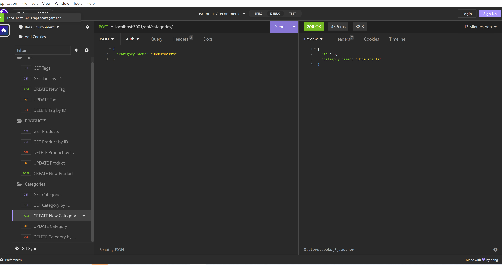

# Landen AutoReadMe Generator

## Title

Landen E-Commerce Site

# Table of Contents

- [GitHub](#github)
- [Description](#description)
- [Installation](#installation)
- [Usage](#usage)
- [License](#license)
- [How To Contribute](#howtocontribute)
- [Tests](#tests)
- [Screenshot](#screenshot)
- [Link](#link)

## GitHub

[Link](https://www.github.com/lwalker107)

## Email

landenwalker880@gmail.com

## Description

E-Commerce backend that incorporates SQL, API routes, Express, Sequelize and Node to create a database of categories,
products and tags and the routes that connect each one to one another.

## Installlation 

npm i

## Usage

Will need mysql2, express, node, dotenv and sequelize for the project to work successfully. Also,
will need Insomnia to test api routes.

## License

MIT

## How to Contribute

You need to know my GitHub username, my email for questions and a working knowledge of Git.

## Tests

## Screenshot

## Link 

https://drive.google.com/file/d/1jMEKk_zVXB3Kri97-3ZoJ5R3_BsX5OQL/view